# LOGIN
O login pede usuário e senha e dá a opção de salvar o usuário.
 
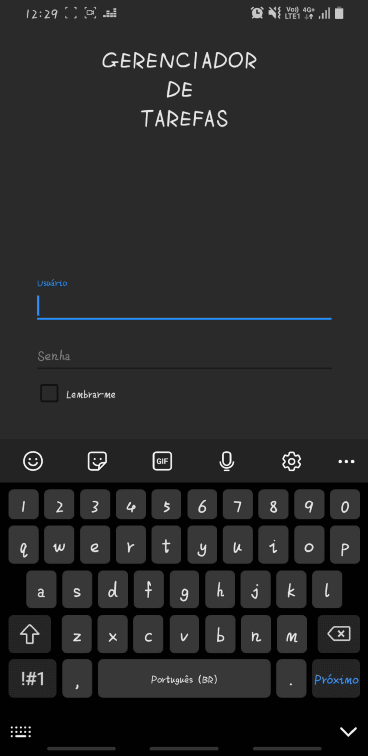
# CRIAR TAREFA
Para criar a tarefa, click no botão com sinal de MAIS do menu principal (gif 1), depois insira o nome da tarefa e a prioridade (gif 2). 
As datas de início e fim da tarefa são selecionadas por um DatePicker, a data inicial não pode ser maior que a final (gif 3). 
A descrição não pode ficar vazia e as datas não podem ficar vazias e nem em formato incorreto. 
Então click no botão CRIAR (gif 4).
 
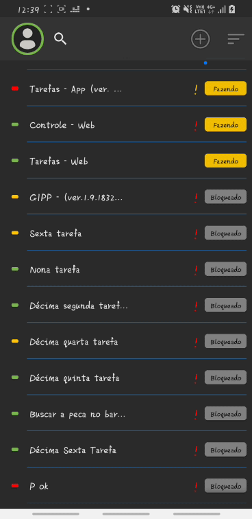 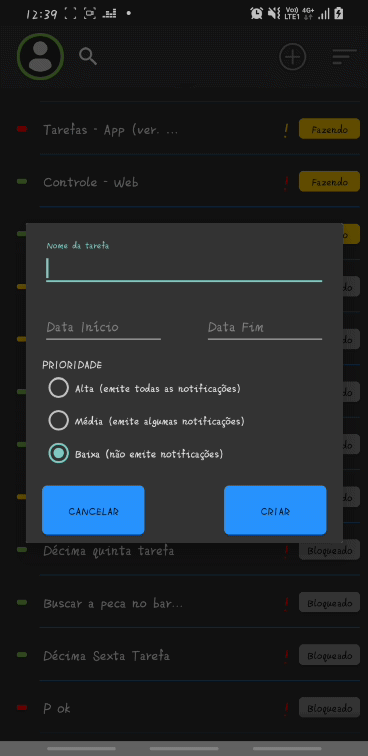 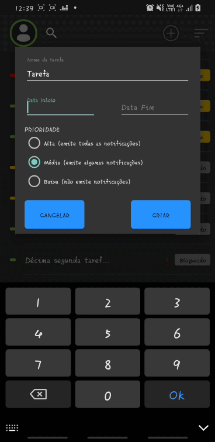 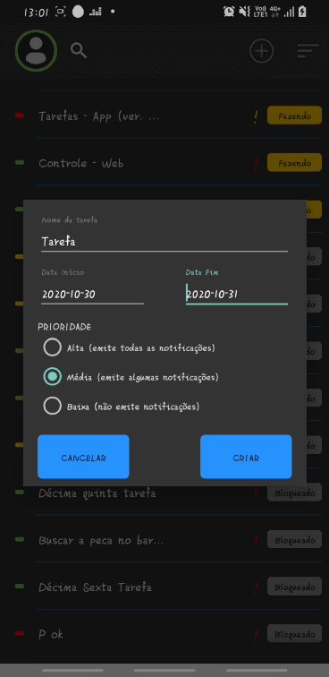
# BUSCA POR DESCRIÇÃO
Para filtrar as tarefas pela descrição, é só dar um click na lupa na barra da aplicação (gif 5). 
Depois conforme o texto digitado vai mudando, a lista vai se adequando a busca (gif 6). 
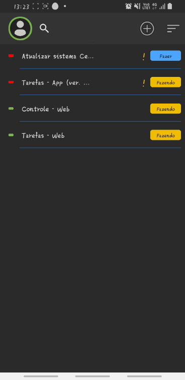 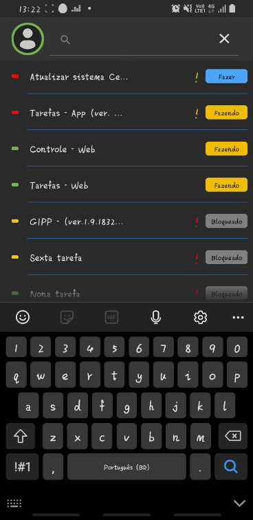
# INFORMAÇÕES DO USUÁRIO
Na barra superior da aplicação aparece a foto do usuário, a cor da borda indica se está conectado ao servidor, vermelho offline e verde online (gif 7). 
Com o click na foto irá aparecer as informações da pessoa conectada (gif 8). 
Caso seja administrador, irá estar disponível um check para visualização como administrador, isso significa que poderá ver todas as tarefas já cadastradas. 
 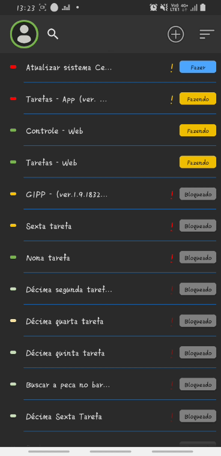
# FILTRO POR ESTADO DA TAREFA E VINCULO DE LOJAS
Para isso dê um click no botão de ordenação (gif 9). 
Selecione seus filtros e dê um OK (gif 10). 
 
# ITENS DA TAREFAS E SEUS ESTADOS
Ao selecionar a tarefa será visivel também o botão de estado da tarefa (gif 11). 
Se o percentual de conclusão for 0% a tarefa fica no estado FAZER (gif 11). 
Quando os intens são marcados o percentual de conclusão aumenta, se for maior que 0% e menor 100%, seu estado fica em FAZENDO (gif 12). 
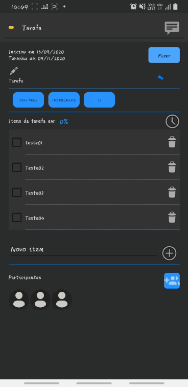  
Logo abaixo da lista, existe um campo para inserir novos itens (gif 13). 
Confirme a inserção no botão ao lado (gif 14). 
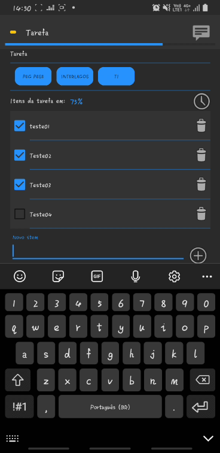 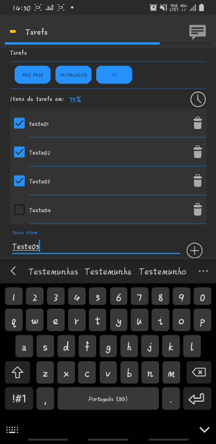 
Quando marcar todos os itens e a tarefa chegar a 100% seu estado mudará para ANALISE, isso significa que o criador da tarefa deve analisar se todos os itens foram realmente concluidos (gif 15). 
Click no botão de estado para confirmar a conclusão da tarefa (gif 16). 
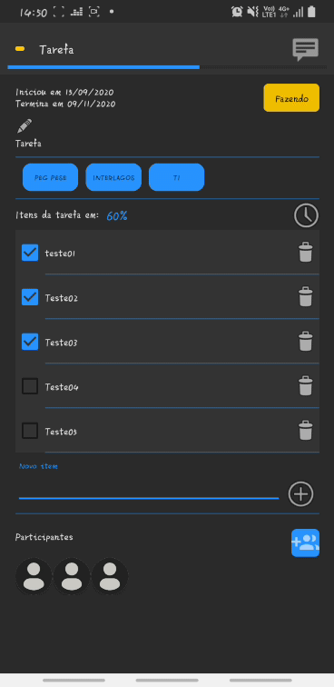 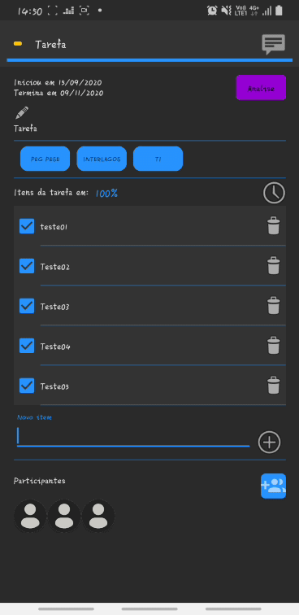 
Um diálogo de confirmação irá aparecer (gif 17). 
Ao confirmar o estado mudará para FEITO (gif 18). Apertando no botão de estado quando a tarefa foi finalizada você poderá restaurar ela caso algum item esteja errado, ou qualquer outro motivo. 
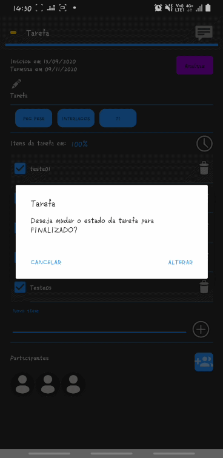 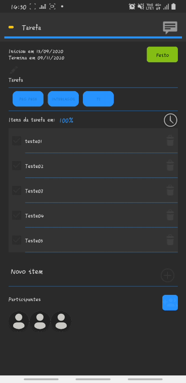 
É preciso inserir o motivo da reabertura da tarefa (gif 19). 
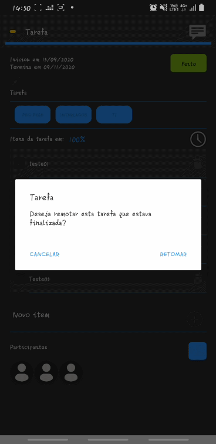 
Você pode desmarcar, ou alterar as informações da tarefa, quando um item é desmarcado, a tarefa muda de ANALISE para FAZENDO (gif 20). 
Para remover um item é só usar o botão com ícone de lixeira de cada item (gif 21). 
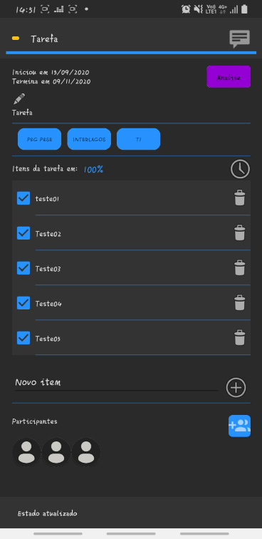  
# DESCRIÇÃO COMPLETA DA TAREFA
Você pode inserir uma descrição completa da tarefa pelo botão com ícone de lápis (gif 22). 
Ao confirmar, a descrição ficará visível na tarefa (gif 23). 
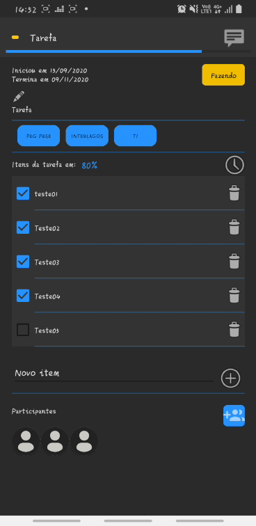 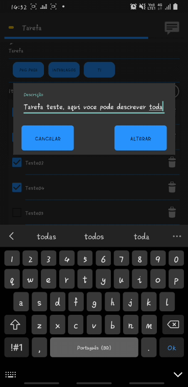 
# PARTICIPANTES DA TAREFA
É possível vincular outros usuários para a tarefa acionando o botão de usuários (gif 24). 
O criador da tarefa e os usuários vinculados ficam visíveis (gif 25). 
  
# HISTÓRICO DA TAREFA
Tudo que é feito na tarefa é gravado em seu histórico, como mudança de estado, alteração de datas, usuários vinculados ou removidos, etc... (gif 26). 
O histórico grava uma descrição com data e hora (gif 27). 
 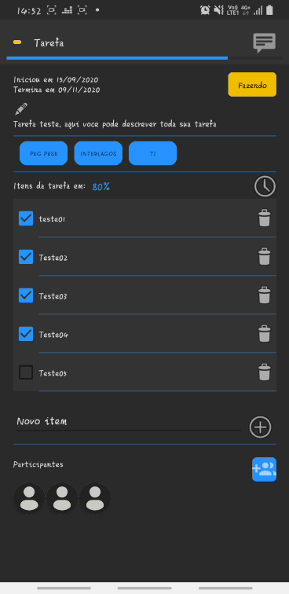 