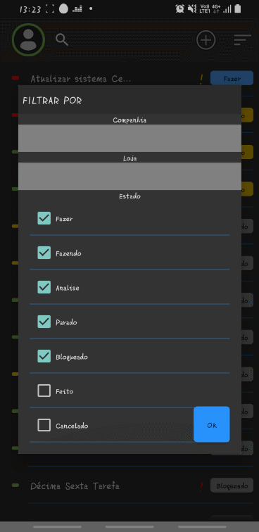

# LOGIN
O login pede usuário e senha e dá a opção de salvar o usuário.
 

# CRIAR TAREFA
Para criar a tarefa, click no botão com sinal de MAIS do menu principal (gif 1), depois insira o nome da tarefa e a prioridade (gif 2). 
As datas de início e fim da tarefa são selecionadas por um DatePicker, a data inicial não pode ser maior que a final (gif 3). 
A descrição não pode ficar vazia e as datas não podem ficar vazias e nem em formato incorreto. 
Então click no botão CRIAR.
 
   
# BUSCA POR DESCRIÇÃO
Para filtrar as tarefas pela descrição, é só dar um click na lupa na barra da aplicação (gif 1). 
Depois conforme o texto digitado vai mudando, a lista vai se adequando a busca (gif 2). 
 
# INFORMAÇÕES DO USUÁRIO
Na barra superior da aplicação aparece a foto do usuário, a cor da borda indica se está conectado ao servidor, vermelho offline e ver online (gif 1). 
Com o click na foto irá aparecer as informações da pessoa conectada (gif 2). 
Caso seja administrador, irá estar disponível um check para visualização como administrador, isso significa que poderá ver todas as tarefas já cadastradas. 
 
# FILTRO POR ESTADO DA TAREFA E VINCULO DE LOJAS
Para isso e um click no botão de ordenação (gif 1). 
Selecione seus filtros e dê um OK (gif 2). 
 
